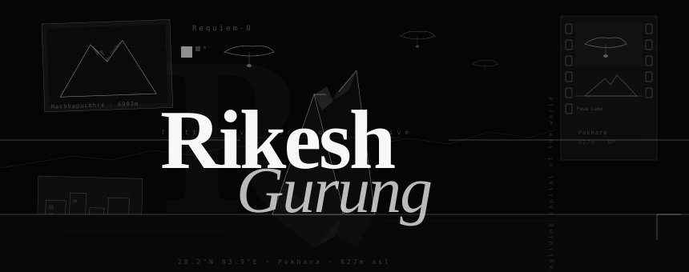

<div align="center">



<br/>
<br/>


</div>

---

<br/>

```
001 — IDENTITY
```

**Requiem-0.**
Flutter developer. Aspiring director. Fashion archivist by instinct.

Building mobile experiences the way good clothes are made —
invisible construction, felt entirely.

Kathmandu, Nepal · student · always shipping

<br/>

```
002 — SELECTED WORKS
```

| season | project | stack | note |
|--------|---------|-------|------|
| SS25 | **RedStringDatingApp** *(private)* | `Flutter` `Dart` `Node.js` | FYP — full-stack dating app w/ admin panel + AI verification |
| FW24 | **[shoppinApp](https://github.com/Requiem-0/shoppinApp)** | `Dart` `Flutter` | built during summer class. clean, fast, intentional |
| SS24 | **[BakeryApp](https://github.com/Requiem-0/BakeryApp)** | `Dart` `Flutter` | mobile-first bakery ordering experience |
| FW23 | **[weatherApp](https://github.com/Requiem-0/weatherApp)** | `C++` | minimalist. 2 pages. location-aware. nothing more |
| SS23 | **[MangaWebsite](https://github.com/Requiem-0/MangaWebsite)** | `Java` | hamro manga ko website |
| — | **[JouranalApp](https://github.com/Requiem-0/JouranalApp)** | `HTML` `.NET MAUI Blazor` | coursework — hybrid journal, web + native |

<br/>

```
003 — CURRENTLY
```

```
building   →   BakeryApp
watching   →   Wong Kar-Wai
wearing    →   Denim pieces
listening  →   TheNBHD, 2Hollis
```

<br/>

```
004 — STACK
```

**mobile**
```
Flutter · Dart · state management · custom animations
responsive layouts · Firebase · REST APIs
```

**web + backend**
```
Node.js · HTML · .NET MAUI Blazor · Java · C++
```

**creative**
```
video editing · directing · fashion archiving
color grading · visual storytelling · art direction
```

<br/>

```
005 — AXIS
```

A mobile developer and a film director do the same thing:
*constrain the frame until only what matters remains.*

Every widget is a decision.
Every cut is a decision.
Both disciplines taught me to be ruthless about what stays.

<br/>

```
006 — CONTACT
```

<div align="left">

[](https://github.com/Requiem-0)
[](https://www.instagram.com/icedamericanodoubleshot/)
[](mailto:0requiem09@gmail.com)

</div>

<br/>

---

<div align="center">

<sub>*the work speaks. the silence speaks louder.*</sub>

<br/>


</div>
